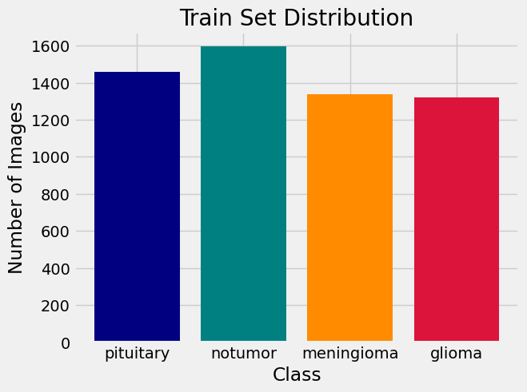
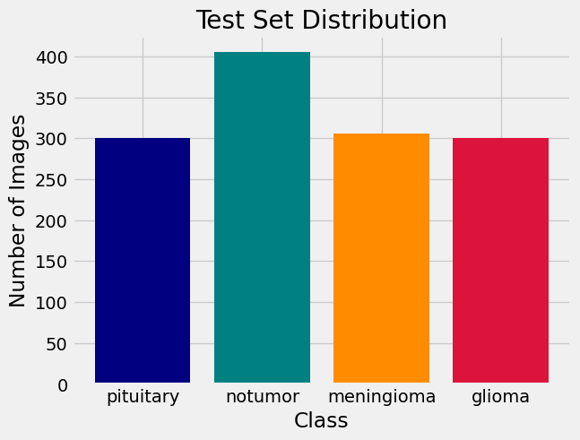
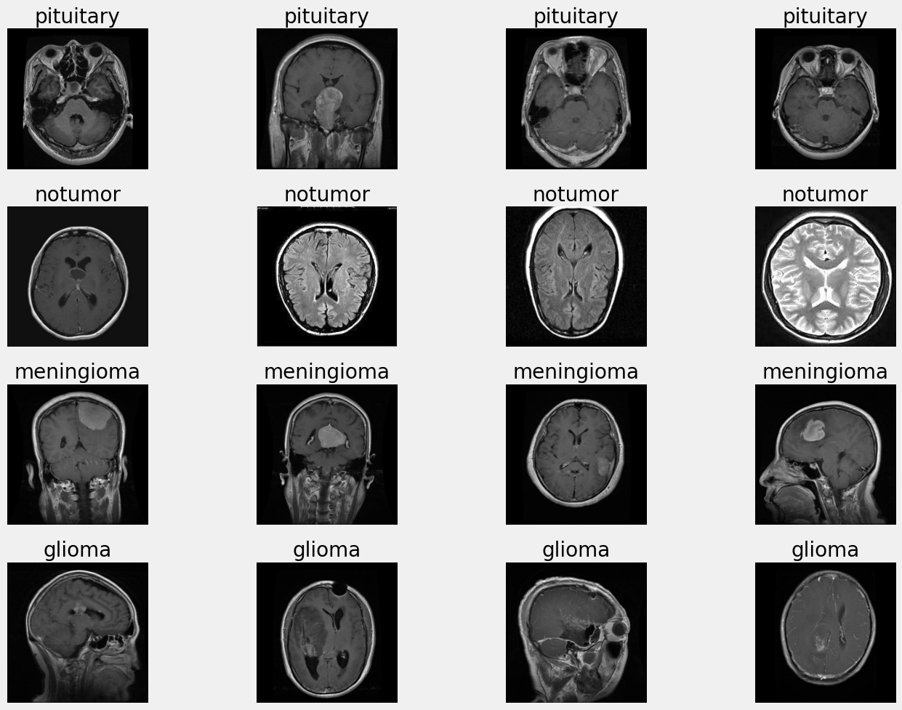
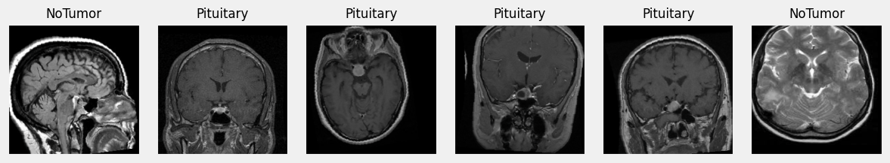
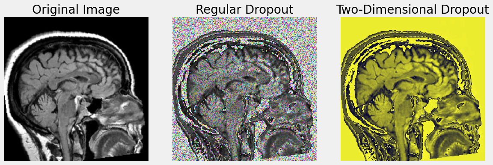

# A Brain Tumor Magnetic Ressonance Imaging (MRI) Classification
> **Author: João Igor Ramos de Lima**

This repository presents a few implementations of convolutional neural network models built using PyTorch for detecting tumors and classifying them in terms of grade, type, and identification of its location in MRI images. Across the implementations, we are going to discuss how to optmize our models for getting a better performance, studying the impact of different parameters, such as input/output channels across the convolutional layers, learning rate, dropout probability and the impact of more blocks.

## Some Informations About the Dataset
The used dataset [**Brain Tumor MRI Dataset**, available on Kaggle](https://www.kaggle.com/datasets/masoudnickparvar/brain-tumor-mri-dataset), contains 7023 images of human brain MRI images which are classified into 4 classes: glioma - meningioma - no tumor and pituitary. The data is already splitted into training and testing sets and the images have variable sizes with typical (`512 x 512`) pixels with avarage (`452 x 454`). To have a good vizualization of the images and the different sizes of tumors, I decided to use a target size of (`256 x 256`) pixels. These are big size images and will incur into a considerable ammount of parameters, like *9369668* in the biggest model. But smaller images would have worst evaluations for losing important information.

Down bellow, take a look at the class distributions in the training set and the testing set.

> Train set distribution

> Test set distribution

Beyond resizing, the function `load_datasets` on the notebook will split data from *Training* and *Testing* folders into training, validation and testing sets, pass images to tensor format, normalize them, get RGB channels, and apply a few augumentation approaches in the training set, such as `RandomHorizontalFlip`, `RandomAffine` (for translating), `ColorJitter` (for changing brightness) and `RandomRotation`.

Look at a few images from training set before and after transformations.

> Training images before transformations

> Training images after transformations

### Applying dropout
In a CNN model is common to use this technique that works by randomly deactivating a fraction of neurons during training based on a probability. It acts preventing co-adapting and reduces overfitting by forcing the network to learn more robusts representations.

The image bellow represents how dropout affects a distribution of output values after applying a linear layer to a fixed input vector.

[dropout_dists.png](./imgs/dropout_dists.png)
> Dropout distributions

We can see that the Dropout maintains the expected value (`around 6.5`) via scaling and increases the **variance** of outputs proportionally to `probability p`.

Take a look at the changing in images applying dropout.

> Images changing using dropout

## Using the model
