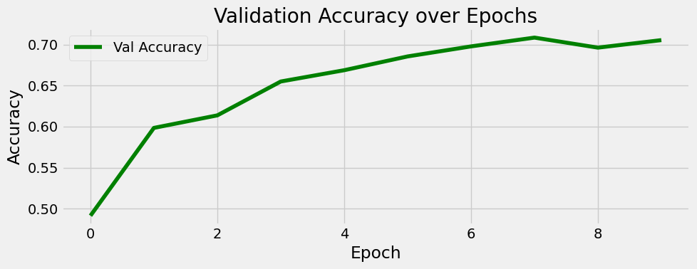
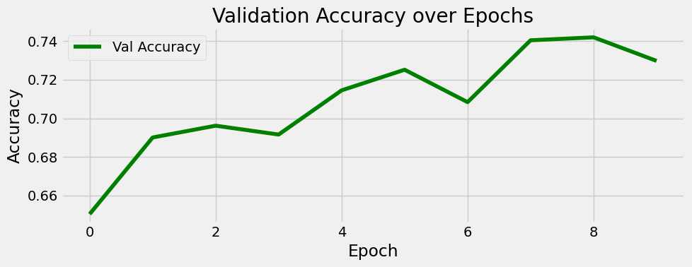
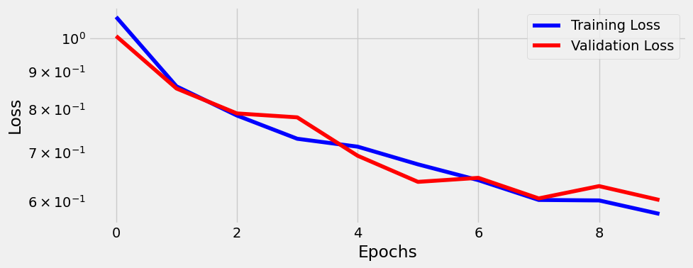
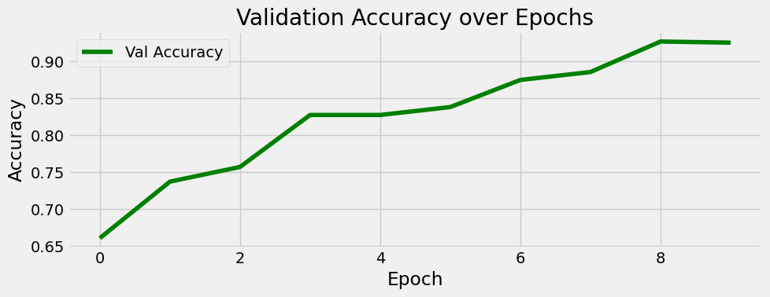

# A Brain Tumor Magnetic Ressonance Imaging (MRI) Classification
> **Author: João Igor Ramos de Lima**

This repository presents a few implementations of convolutional neural network models built using PyTorch for detecting tumors and classifying them in terms of grade, type, and identification of its location in MRI images. Across the implementations, we are going to discuss how to optmize our models for getting a better performance, studying the impact of different parameters, such as input/output channels across the convolutional layers, learning rate, dropout probability and the impact of more blocks.

## Some Informations About the Dataset
The used dataset [**Brain Tumor MRI Dataset**, available on Kaggle](https://www.kaggle.com/datasets/masoudnickparvar/brain-tumor-mri-dataset), contains 7023 images of human brain MRI images which are classified into 4 classes: glioma - meningioma - no tumor and pituitary. The data is already splitted into training and testing sets and the images have variable sizes with typical (`512 x 512`) pixels with avarage (`452 x 454`). To have a good vizualization of the images and the different sizes of tumors, I decided to use a target size of (`256 x 256`) pixels. These are big size images and will incur into a considerable ammount of parameters, like *9369668* in the biggest model. But smaller images would have worst evaluations for losing important information.

Down bellow, take a look at the class distributions in the training set and the testing set.


> Train set distribution


> Test set distribution

Beyond resizing, the function `load_datasets` on the notebook will split data from *Training* and *Testing* folders into training, validation and testing sets, pass images to tensor format, normalize them, get RGB channels, and apply a few augumentation approaches in the training set, such as `RandomHorizontalFlip`, `RandomAffine` (for translating), `ColorJitter` (for changing brightness) and `RandomRotation`.

Look at a few images from training set before and after transformations.


> Training images before transformations


> Training images after transformations

### Applying Dropout
In a CNN model is common to use this technique that works by randomly deactivating a fraction of neurons during training based on a probability. It acts preventing co-adapting and reduces overfitting by forcing the network to learn more robusts representations.

The image bellow represents how dropout affects a distribution of output values after applying a linear layer to a fixed input vector.

[dropout_dists.png](./imgs/dropout_dists.png)
> Dropout distributions

We can see that the Dropout maintains the expected value (`around 6.5`) via scaling and increases the **variance** of outputs proportionally to `probability p`.

Take a look at the changing in images applying dropout.


> Images changing using dropout

## Using a Base Model

To get a model with less parameters by first, I decided to use four convolutional layers with `kernel_size=3`, `padding=1` and `stride=0`, each one followed by a Relu and a MaxPool with `padding=0`, `kernel_size=2` and `stride=2`. The conv functions with this configs did not changed the size of the image, but the maxpool reduced it to its half size.

Despite the quantity of convolutional blocks, I decided to keep small input/output channels change to turn it less complex but with enough info in each image.

**Architecture Overview:**

* (`3, 256, 256`) → Conv → (`4, 256, 256`) → MaxPool → (`4, 128, 128`)
* (`4, 128, 128`) → Conv → (`4, 128, 128`) → MaxPool → (`4, 64, 64`)
* (`4, 64, 64`) → Conv → (`4, 64, 64`) → MaxPool → (`4, 32, 32`)
* (`4, 32, 32`) → Conv → (`4, 32, 32`) → MaxPool → (`4, 16, 16`)
* Flatten → Linear(`1024 → 32`) → Linear(`32 → 4`)
* 0.3 dropout probability between FC layers

**Training Summary:**
* Total parameters: 33488
* Adam Optimizer with `lr=3e-4`
* Epochs Trained: 10

**Parameter counts across the layers:**
* conv1: 112
* conv2: 148
* conv3: 148
* conv4: 148
* fc1: 32800
* fc2: 132

**Validation Performance:**
* Last Accuracy: 0.71
* Last Precision: 0.70
* Last Recall: 0.70
* No notable overfitting.

 
> Accuracy over epochs on first model


> Loss ploting on first model

### Evaluation on test set

Classification Report

```text
Classification Report:
              precision    recall  f1-score   support

   pituitary       0.73      0.56      0.64       147
     notumor       0.56      0.47      0.51       149
  meningioma       0.86      0.85      0.86       210
      glioma       0.68      0.95      0.79       150

    accuracy                           0.72       656
   macro avg       0.71      0.71      0.70       656
weighted avg       0.72      0.72      0.72       656
```


> Confusion matrix on first model

## Using the Base Model with Features Variation

Here, we used the same four convolutional layers as before, but by this time, changing the input/output channels ratio to use more filters and get a few more information through the layers. It incurred in a notable increase on the parameters count, but a small change on performance.

**Architecture Overview:**
* (`3, 256, 256`) → Conv → (`4, 256, 256`) → MaxPool → (`4, 128, 128`)
* (`4, 128, 128`) → Conv → (`8, 128, 128`) → MaxPool → (`8, 64, 64`)
* (`8, 64, 64`) → Conv → (`16, 64, 64`) → MaxPool → (`16, 32, 32`)
* (`16, 32, 32`) → Conv → (`16, 32, 32`) → MaxPool → (`16, 16, 16`)
* Flatten → Linear(`4096 → 64`) → Linear(`64 → 4`)
* 0.3 dropout probability between FC layers

**Training Summary:**
* Total parameters: 266364
* Adam Optimizer with `lr=3e-4`
* Epochs Trained: 10

**Parameter counts across the layers:**
* conv1: 112
* conv2: 296
* conv3: 1168
* conv4: 2320
* fc1: 262208
* fc2: 260

**Validation Performance:**
* Last Accuracy: 0.73
* Last Precision: 0.73
* Last Recall: 0.72
* No notable overfitting.

 
> Accuracy over epochs on second model


> Loss ploting on second model

### Evaluation on test set

Classification Report

```text
Classification Report:
              precision    recall  f1-score   support

   pituitary       0.84      0.55      0.67       147
     notumor       0.60      0.52      0.56       149
  meningioma       0.86      0.94      0.90       210
      glioma       0.73      0.97      0.84       150

    accuracy                           0.77       656
   macro avg       0.76      0.75      0.74       656
weighted avg       0.77      0.77      0.76       656
```


> Confusion matrix on second model

## Adding one More Convolutional Block on Base Model

Here, I added one more layer (`Conv + Relu + MaxPool`) that resized the image to its half size again. One good surprise was that I also increased the input/output channels ratio on convs and fc layers, but the ammount of parameters was smaller with a better performance. 

**Architecture Overview:**
* (`3, 256, 256`) → Conv → (`4, 256, 256`) → MaxPool → (`4, 128, 128`)
* (`4, 128, 128`) → Conv → (`8, 128, 128`) → MaxPool → (`8, 64, 64`)
* (`8, 64, 64`) → Conv → (`16, 64, 64`) → MaxPool → (`16, 32, 32`)
* (`16, 32, 32`) → Conv → (`32, 32, 32`) → MaxPool → (`32, 16, 16`)
* (`32, 16, 16`) → Conv → (`32, 16, 16`) → MaxPool → (`32, 8, 8`)
* Flatten → Linear(`2048 → 64`) → Linear(`64 → 4`)
* 0.3 dropout probability before first FC layer

**Training Summary:**
* Total parameters: 146860
* Adam Optimizer with `lr=3e-4`
* Epochs Trained: 10

**Parameter counts across the layers:**
* conv1: 112
* conv2: 296
* conv3: 1168
* conv4: 4640
* conv5: 9248
* fc1: 131136
* fc2: 260

**Validation Performance:**
* Last Accuracy: 0.78
* Last Precision: 0.80
* Last Recall: 0.78
* No notable overfitting.

 
> Accuracy over epochs on third model


> Loss ploting on third model

### Evaluation on test set

Classification Report

```text
Classification Report:
              precision    recall  f1-score   support

   pituitary       0.95      0.54      0.69       147
     notumor       0.63      0.72      0.67       149
  meningioma       0.92      0.95      0.93       210
      glioma       0.78      0.97      0.86       150

    accuracy                           0.81       656
   macro avg       0.82      0.79      0.79       656
weighted avg       0.83      0.81      0.80       656
```


> Confusion matrix on third model

## A Clearly Better Model (but a lot more parameters)

On this last model, I used a lot more of filters, increasing a lot of the input/output channels ratio and got a huge quantity of parameters and a very good performance that would be easily extended to a *Three Sigma* accuracy version if used a good number of epochs like 100.

**Architecture Overview:**
* (`3, 256, 256`) → Conv → (`32, 256, 256`) → MaxPool → (`32, 128, 128`)
* (`32, 128, 128`) → Conv → (`64, 128, 128`) → MaxPool → (`64, 64, 64`)
* (`64, 64, 64`) → Conv → (`128, 64, 64`) → MaxPool → (`128, 32, 32`)
* (`128, 32, 32`) → Conv → (`256, 32, 32`) → MaxPool → (`256, 16, 16`)
* (`256, 16, 16`) → Conv → (`256, 16, 16`) → MaxPool → (`256, 8, 8`)
* Flatten → Linear(`16384 → 512`) → Linear(`512 → 4`)
* 0.5 dropout probability between FC layers

**Training Summary:**
* Total parameters: 9369668
* Adam Optimizer with `lr=7e-4`
* Epochs Trained: 10

**Parameter counts across the layers:**
* conv1: 896
* conv2: 18496
* conv3: 73856
* conv4: 295168
* conv5: 590080
* fc1: 8389120
* fc2: 2052

**Validation Performance:**
* Last Accuracy: 0.93
* Last Precision: 0.93
* Last Recall: 0.92
* No notable overfitting.

 
> Accuracy over epochs on last model


> Loss ploting on last model

### Evaluation on test set

Classification Report

```text
Classification Report:
              precision    recall  f1-score   support
   pituitary       0.95      0.54      0.69       147
     notumor       0.63      0.72      0.67       149
  meningioma       0.92      0.95      0.93       210
      glioma       0.78      0.97      0.86       150

    accuracy                           0.81       656
   macro avg       0.82      0.79      0.79       656
weighted avg       0.83      0.81      0.80       656
```


> Confusion matrix on last model

### Looking at the intermediate layers output using hooks

First convolutional layer output:

> See the [complete image here](./imgs/conv1_layer.png)

Second convolutional layer output:

> See the [complete image here](./imgs/conv2_layer.png)

Third convolutional layer output:

> See the [complete image here](./imgs/conv3_layer.png)

Fourth convolutional layer output:

> See the [complete image here](./imgs/conv4_layer.png)

Fifth convolutional layer output:

> See the [complete image here](./imgs/conv5_layer.png)
